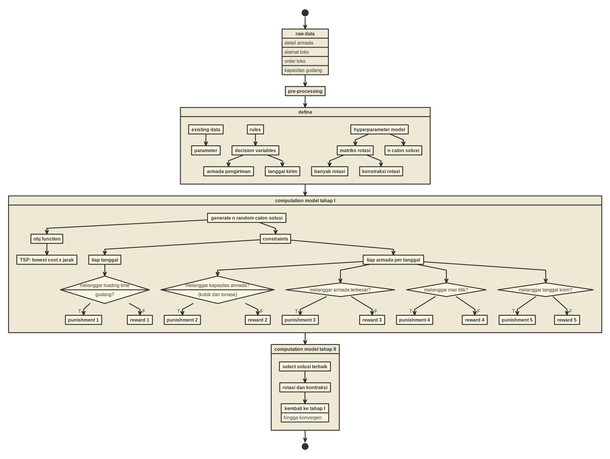

```{r setup, include=FALSE}
knitr::opts_chunk$set(echo = TRUE)
setwd("~/NTOP/Pilot Ikang Ciawi/Dokumentasi")

rm(list=ls())

library(dplyr)
library(tidyr)

load("dokumentasi.rda")
```

# PENDAHULUAN

## Latar Belakang

Setiap hari, tim DTA membuat rute untuk _transporter_ mendistribusikan produk jadi ke konsumen-konsumen Nutrifood yang telah melakukan _order_. Proses ini masih dilakukan secara manual. Akibatnya proses ini memakan waktu yang cukup lama dan tidak ada kejaminan bahwa rute yang dipilih sudah optimal atau belum. Oleh karena itu, tim DTA bersama dengan tim _Digital Transformation_ dan _Market Research_ berusaha untuk membuat model optimisasi dari permasalahan ini.

## Tujuan

Membuat model optimisasi rute _transporter_ yang meminimalkan _total cost_, yakni dengan membuat konfigurasi:

> __Order toko mana yang harus dikirim pada tanggal berapa dan menggunakan armada apa.__

## Ruang Lingkup

_Business process_ yang terjadi selama ini sangat kompleks, oleh karena itu penelitian ini dibatasi pada lingkup sebagai berikut saja:

### _Business Process_ yang Hendak Dikerjakan 

Untuk mengirimkan produk jadi dari Gudang Ciawi dan Cibitung, tim DTA menyewa _transporter_ dengan berbagai jenis armada kendaraan. Masing-masing kendaraan tersebut memiliki spesifikasi yang berbeda-beda, seperti: 

1. Kapasitas maksimal kubikasi yang bisa diangkut, 
1. Kapasitas maksimal tonase yang bisa diangkut, 
1. Biaya sewa (per km). Diasumsikan biaya sewa ini nilainya tetap (tidak dipengaruhi oleh faktor lain seperti _habit_ supir dan perbedaan rute yang ditempuh), dan
1. _Loading time_. 

Masing-masing armada tersebut juga memiliki keterbatasan dari segi jumlah armada yang bisa disewa dan berapa banyak titik konsumen yang bisa dilalui.

Konsumen memesan (melalui proses _purchase order_ - PO) sejumlah produk jadi kepada Nutrifood. Pada PO tersebut, kita memiliki informasi sebagai berikut:

1. Berapa total kubik dan tonase produk yang harus dikirim. 
1. _Range_ tanggal pengiriman produk. 

Nutrifood harus memenuhi pembelian tersebut secara langsung (tidak boleh memecah pengiriman produk dalam satu PO menjadi beberapa kali pengiriman). Masing-masing konsumen akan dilayani oleh gudang Ciawi atau Cibitung sesuai dengan pembagian yang telah ditetapkan sebelumnya. Tidak ada konsumen yang dilayani oleh keduanya.

Masing-masing konsumen memiliki keterbatas lain terkait armada yang bisa dilalui karena lokasi mereka berbeda-beda. Ada konsumen yang berlokasi di jalan besar sehingga armada ukuran besar bisa melewatinya dengan aman. Namun ada beberapa konsumen yang lokasinya hanya bisa dilalui oleh armada kecil.

## Metode Penyelesaian Model Optimisasi

Untuk menyelesaikan model optimisasi ini, saya akan menggunakan pendekatan _meta heuristic_ dibandingkan penyelesaian secara _exact_. Berikut alasannya:

1. Kita tidak perlu menuliskan model matematika yang kompleks karena permasalahan yang kita hadapi ini memiliki indeks yang tinggi. Kita cukup menuliskan algoritma (_computational model_) berdasarkan definisi dan _constraints_ secara logis. Sehingga proses _modelling_ bisa dilakukan dengan lebih cepat.
1. Penyelesaian dengan metode _exact_ memang menjamin keoptimalan solusi. Sedangkan penyelesaian dengan metode _meta heuristic_, walaupun tidak ada jaminan solusi yang didapatkan adalah solusi yang paling optimal tapi kita bisa mencari solusi _near optimal_ dengan melakukan _tweaking_ pada algoritma tersebut.

Pendekatan _meta heuristic_ yang akan saya gunakan adalah _Spiral Dynamic Optimization Algorithm_.


# _SPIRAL DYNAMIC OPTIMIZATION ALGORITHM_ (SDOA)

## Penjelasan Singkat

_Spiral Dynamic Optimization Algorithm_ (SDOA) adalah salah satu metode _meta heuristic_ yang digunakan untuk mencari minimum global dari suatu sistem persamaan. SDOA termasuk ke dalam salah satu _greedy algorithm_ yang biasa digunakan untuk memecahkan berbagai masalah dalam sains dan _engineering_.

Algoritmanya mudah dipahami dan intuitif tanpa harus memiliki latar keilmuan tertentu. Proses kerjanya adalah dengan melakukan _random number generating_ pada suatu selang dan melakukan rotasi sekaligus kontraksi dengan titik paling minimum pada setiap iterasi sebagai pusatnya. Pusat rotasi akan dipilih dari calon solusi yang _near optimal_. Dengan adanya iterasi tersebut, proses eksploitasi dan eksplorasi terhadap calon solusi lain bisa dijalankan sehingga kita akan dapatkan solusi paling optimal di akhir iterasi.

Berikut adalah algoritmanya:

```
INPUT
  m >= 2 # jumlah titik
  theta  # sudut rotasi (0 <= theta <= 2pi)
  r      # konstraksi
  k_max  # iterasi maksimum
PROCESS
  1 generate m buah titik secara acak
      x_i
  2 initial condition
      k = 0 # untuk keperluan iterasi
  3 cari x_* yang memenuhi
      min(f(x_*))
  
  4 lakukan rotasi dan konstraksi semua x_i
      x_* sebagai pusat rotasi
      k = k + 1
  5 ulangi proses 3 dan 4
  6 hentikan proses saat k = k_max
      output x_*
```

Berdasarkan algoritma di atas, salah satu proses yang penting adalah melakukan __rotasi__ dan __konstraksi__ terhadap semua titik yang telah di-_generate_.

## Menyelesaikan Masalah Optimisasi dengan SDOA

Permasalahan Nutrifood terkait _transporter_ merupakan salah satu bentuk _Mixed Integer Non Linear Programming_ (MINLP). Secara umum, bentuk MINLP bisa ditulis sebagai berikut:

$$\min_{x \in \mathbb{R}^n} f(x)$$

$$\text{subject to: } g_i(x) = 0, i = 1,2,..,M$$

$$\text{and } h_j(x) \leq 0,i = 1,2,..,N$$

$$x = (x_1,x_2,...,x_n)^T \in \mathbb{N}$$

Agar bisa diselesaikan dengan SDOA, kita akan mengubah bentuk di atas menjadi:

$$F(x,\alpha,\beta) = f(x) + \sum_{i=1}^M \alpha_i g_i^2(x) + \sum_{j = 1}^N \beta_j (\max{(h_j(x),0)})^2$$

dimana $\alpha,\beta$ merupakan _penalty constant_ yang bisa dibuat sangat besar. Model komputasi ini dikenal juga dengan sebutan _reinforce learning_.


## Matriks Rotasi untuk n-Dimensi

SOA relatif mudah untuk dituliskan dalam bentuk algoritma bahasa pemrograman manapun. Tapi ada satu hal yang bisa menjadi batu ganjalan dalam menuliskan algoritmanya. Apa itu? Yaitu pendefinisian matriks rotasi untuk masalah dengan n-dimensi.

Bentuk umum dari matriks rotasi adalah sebagai berikut:

$$R^{(n)} (\theta_{1,2},\theta_{1,3},..,\theta_{n,n-1}) = \prod_{i=1}^{n-1} \left ( \prod_{j=1}^i R^{(n)}_{n-i,n+1-j} (\theta_{n-i,n+1-j}) \right )$$

Perhatikan bahwa perkalian matriks rotasi yang dilakukan adalah _cross product_ bukan _dot product_ (karena rotasi tidak mengubah _norm_ suatu vektor).

## Catatan Terkait Algoritma SDOA

Sampai saat ini tidak ada _library_ khusus untuk SDOA karena algoritma ini bersifat umum karena sifatnya _customize_ tergantung dari permasalahan yang dihadapi. 

Pada kasus ini, algoritma dibuat dengan bahasa __R__ dengan bantuan `library(tidyverse)` (untuk keperluan _data wrangling_) dan `library(parallel)` (untuk keperluan _parallel processing_). Oleh karena itu, algoritma ditulis dengan memanfaatkan prinsip _parallel processing_.

Algoritma ini dijalankan pada __Ubuntu OS__ dengan memanfaatkan 7 _cores_ _processor_.

## _Flowchart_ Pengerjaan SDOA

Berikut ada _flowchart_ pengerjaan dan pembuatan model ini hingga mendapatkan solusi optimal.

```{r out.width="150%",echo=FALSE,fig.retina=10,fig.width=10}

```


# DATA TERKAIT

Pada _report_ ini, kita akan gunakan data yang sudah dihimpun oleh tim DTA dan DT. Berikut adalah data-data yang sudah dilakukan _pre-processing_:

## Data Terkait Order Toko

Untuk memudahkan perhitungan model optimisasi, saya akan memilih _sales order_ pada rentang tanggal berikut ini:

```{r,echo=FALSE}
df_sales_order_ready %>% 
  select(-sales_order) %>% 
  mutate(tanggal_kirim_min = tanggal_minimal + tanggal_kirim_min - 1,
         tanggal_kirim_max = tanggal_minimal + tanggal_kirim_max - 1) %>% 
  rename(order_kg = order_tonase) %>% 
  DT::datatable(caption = "Data Sales Order",filter = "bottom")
```

## Data Informasi Detail Toko

```{r,echo=FALSE}
df_cust_complete_ready %>% 
  DT::datatable(caption = "Data Informasi Detail ALamat Toko",filter = "bottom")
```

## Data Gudang

```{r,echo=FALSE}
df_gudang %>% 
  DT::datatable(caption = "Data Gudang",filter = "none")
```

Pada _trial_ ini, saya hanya menggunakan data _weekday_ saja.

## Data Armada

Terkait jenis armada `CONT 20` dan `CONT 40`, saya akan berikan nilai besar untuk parameter yang masih _blank_ pada data, yakni pada:

1. _Cost_ per kilometer,
1. Kapasitas tonase.
1. _Max_ titik customer yang bisa dikirim.
1. _Loading time_.

Terkait ketersediaan, karena ke depannya bisa berpotensi menjadi parameter yang penting maka tetap saya masukkan ke dalam model namun angkanya bisa ditetapkan suatu nilai yang "besar".

```{r,echo=FALSE}
df_armada %>% 
  mutate(jenis_armada = c("Carry","CDE","CDD","CDD Jumbo","FUSO","TRONTON",
                          "BU","CONT 20","CONT 40")) %>% 
  rename(max_cap_kg = max_cap_tonase) %>% 
  relocate(jenis_armada,.before = max_cap_kubikasi) %>% 
  DT::datatable(caption = "Data Armada",filter = "none")
```


# HASIL OPTIMISASI

## _Decision Variables_

Model optimisasi ini menghasilkan dua _decision variables_, yakni:

1. Tanggal kirim, dan
1. Armada yang digunakan.

Untuk masing-masing _order_ toko.

## _Objective Function_

Fungsi objektif pada model ini adalah:

> Meminimumkan total biaya yang timbul dari setiap keputusan toko $i$ dikirim armada $j$ pada tanggal $k$ tanpa melanggar _constraints_ yang ada.

## Solusi Model

```{r,include=FALSE}
rm(list=ls())

load("ciawi done.rda")

# jangan lupa ganti tanggal
tanggal_minimal = as.Date(as.character("2022-11-29"),
                          "%Y-%m-%d")

# kita split berdasarkan tanggal kirim
list_jadwal = 
  df_temp_3 %>% 
  mutate(tanggal_kirim = tanggal_kirim + tanggal_minimal - 1) %>% 
  select(-long,-lat,-cost_per_km) %>% 
  group_split(tanggal_kirim)

# kita akan buat contoh dulu
# temp = list_jadwal[[1]]

# function untuk print datanya
printing = function(temp){
  tanggal    = paste0("Pengiriman tanggal: ",temp$tanggal_kirim[1])
  temp = 
    temp %>% 
    select(nama_toko,id_armada,armada,order_kubikasi,order_tonase) %>% 
    arrange(id_armada) %>% 
    rename(jenis_armada = armada,
           armada_ke = id_armada)
    
  armada_ke = temp$armada_ke %>% unique()
  id_new    = 1:length(armada_ke)
  df_refer  = data.frame(armada_ke,id_new)
  
  merge(temp,df_refer) %>% 
    select(-armada_ke) %>% 
    rename(armada_ke = id_new) %>% 
    relocate(armada_ke,.before = jenis_armada) %>% 
    knitr::kable(caption = tanggal)
}

```


```{r,echo=FALSE}
i    = 1
temp = list_jadwal[[i]]
printing(temp)

i    = 2
temp = list_jadwal[[i]]
printing(temp)

i    = 3
temp = list_jadwal[[i]]
printing(temp)

i    = 4
temp = list_jadwal[[i]]
printing(temp)

i    = 5
temp = list_jadwal[[i]]
printing(temp)

i    = 6
temp = list_jadwal[[i]]
printing(temp)

i    = 7
temp = list_jadwal[[i]]
printing(temp)
```


