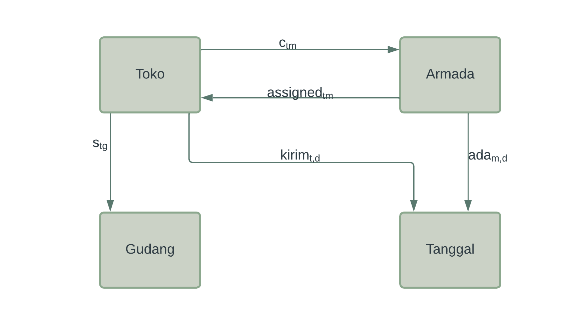

```{r setup, include=FALSE}
knitr::opts_chunk$set(echo = TRUE)
library(dplyr)
library(ggplot2)
options(scipen = 999)
rm(list=ls())

load("/cloud/project/input/data dokumentasi.rda")
```

\newpage
\tableofcontents
\newpage
\listoftables
\listoffigures
\newpage

# PENDAHULUAN

## Latar Belakang

Setiap hari, tim DTA membuat rute untuk _transporter_ mendistribusikan produk jadi ke konsumen-konsumen Nutrifood yang telah melakukan _order_. Proses ini masih dilakukan secara manual. Akibatnya proses ini memakan waktu yang cukup lama dan tidak ada kejaminan bahwa rute yang dipilih sudah optimal atau belum. Oleh karena itu, tim DTA bersama dengan tim _Digital Transformation_ dan _Market Research_ berusaha untuk membuat model optimisasi dari permasalahan ini.

## Tujuan

Membuat model optimisasi rute _transporter_ yang meminimalkan _total cost_ yang dibuat.

## Ruang Lingkup

_Business process_ yang terjadi selama ini sangat kompleks, oleh karena itu penelitian ini dibatasi pada lingkup sebagai berikut saja:

### _Business Process_ yang Hendak Dikerjakan

Untuk mengirimkan produk jadi dari Gudang Ciawi dan Cibitung, tim DTA menyewa _transporter_ dengan berbagai jenis armada kendaraan. Masing-masing kendaraan tersebut memiliki spesifikasi yang berbeda-beda, seperti: 

1. Kapasitas maksimal kubikasi yang bisa diangkut, 
1. Kapasitas maksimal tonase yang bisa diangkut, 
1. Biaya sewa (per km). Diasumsikan biaya sewa ini nilainya tetap (tidak dipengaruhi oleh faktor lain seperti _habit_ supir dan perbedaan rute yang ditempuh), dan
1. _Loading time_. 

Masing-masing armada tersebut juga memiliki keterbatasan dari segi jumlah armada yang bisa disewa dan berapa banyak titik konsumen yang bisa dilalui.

Konsumen memesan (melalui proses _purchase order_ - PO) sejumlah produk jadi kepada Nutrifood. Pada PO tersebut, kita memiliki informasi sebagai berikut:

1. Berapa total kubik dan tonase produk yang harus dikirim. 
1. _Range_ tanggal pengiriman produk. 

Nutrifood harus memenuhi pembelian tersebut secara langsung (tidak boleh memecah pengiriman produk dalam satu PO menjadi beberapa kali pengiriman). Masing-masing konsumen akan dilayani oleh gudang Ciawi atau Cibitung sesuai dengan pembagian yang telah ditetapkan sebelumnya. Tidak ada konsumen yang dilayani oleh keduanya.

Masing-masing konsumen memiliki keterbatas lain terkait armada yang bisa dilalui karena lokasi mereka berbeda-beda. Ada konsumen yang berlokasi di jalan besar sehingga armada ukuran besar bisa melewatinya dengan aman. Namun ada beberapa konsumen yang lokasinya hanya bisa dilalui oleh armada kecil.

# DATA TERKAIT

Data _real_ dari DTA dan gudang sedang disusun oleh tim terkait. Oleh karena itu, saya akan gunakan data _dummy_ berdasarkan informasi pada bagian sebelumnya.

## Data Terkait _Order_ Toko

```{r,echo=FALSE,message=FALSE}
df_order %>% knitr::kable(caption = "Data Order Toko")
```

Penjelasan terkait variabel dari tabel di atas:

1. `nama_toko`, yakni nama-nama toko yang melakukan _order_ produk ke Nutrifood.
1. `order_kubikasi`, yakni berapa total kubik produk yang dipesan. Satuan yang digunakan adalah $m^2$.
1. `order_tonase`, yakni berapa total kilogram produk yang dipesan.
1. `tanggal_kirim_min`, yakni tanggal berapa produk sudah bisa dikirim.
1. `tanggal_kirim_max`, yakni tanggal berapa produk paling lambat harus dikirim.

## Data Terkait Informasi Detail Toko

```{r,echo=FALSE,message=FALSE}
df_toko %>% knitr::kable(caption = "Data Informasi Toko")
```

Penjelasan terkait variabel dari tabel di atas:

1. `nama_toko`, yakni nama-nama toko yang melakukan _order_ produk ke Nutrifood.
1. `long`, yakni _longitude_ dari alamat toko.
1. `lat`, yakni _latitude_ dari alamat toko.
1. `max_armada`, yakni jenis armada terbesar yang bisa masuk ke toko. Misalkan, jika `max_armada = 2`, artinya toko tersebut bisa dilalui armada jenis `1` dan `2`.
1. `supplied`, yakni gudang yang men-_supply_ toko tersebut.

## Data Terkait Gudang

```{r,echo=FALSE,message=FALSE}
df_gudang %>% knitr::kable(caption = "Data Time Slot Gudang")
```


Penjelasan terkait variabel pada tabel di atas:

1. `site`, jenis gudang: Ciawi atau Cibitung.
1. `week_day_hour`, total waktu kerja yang tersedia pada hari kerja untuk melakukan _loading_ produk dari gudang ke armada. Satuan dari data ini adalah dalam jam.
1. `week_end_hour`, total waktu kerja yang tersedia pada hari libur untuk melakukan _loading_ produk dari gudang ke armada. Satuan dari data ini adalah dalam jam.

Kedua data total waktu kerja ini berdasarkn jam kerja pada dua _shift_.

\newpage
\blandscape

## Data Terkait Armada

```{r,echo=FALSE,message=FALSE}
df_jenis_armada %>% knitr::kable(caption = "Data Informasi Armada")
```


Penjelasan terkait variabel dari tabel di atas:

1. `armada`, yakni jenis armada yang bisa disewa Nutrifood.
1. `max_cap_kubikasi`, yakni kapasitas maksimum kubikasi yang bisa diangkut oleh armada tersebut. Satuan dari data ini $m^2$.
1. `max_cap_tonase`, yakni kapasitas maksimum berat barang yang bisa diangkut oleh armada tersebut. Satuan dari data ini $kg$.
1. `cost_per_km`, yakni berapa biaya sewa mobil per kilometer untuk mobil tersebut. Satuan dari data ini $Rp$. Informasi dari tim DTA:
    - Secara _real_, nilainya berbeda-beda tergantung _provider_ yang digunakan walau jenis mobilnya sama.
    - Hal ini terjadi karena perbedaan _habit_ mengemudi para _driver_ dan rute yang diambil.
    - Oleh karena itu, pada kasus ini, nilainya kita asumsikan sama karena tidak ada kepastian _provider_ mana yang akan tersedia pada hari pengiriman tersebut.
1. `tersedia`, yakni berapa banyak armada tersebut tersedia untuk disewa. Informasi dari tim DTA:
    - Pada kondisi _real_, tidak ada pembatasan berapa banyak armada yang tersedia. Bisa diasumsikan nilainya _unlimited_.
    - Namun, ada baiknya jika kita masukan parameter batas ini untuk mengakomodir kebutuhan di kemudian hari.
    - Untuk keperluan komputasi, ketersediaan ini tidak saya jadikan parameter pada model, tapi digunakan untuk mereplikasi baris data pada tabel di atas.
1. `max_titik`, yakni berapa banyak maksimal konsumen yang pesanannya bisa diantar.
1. `loading_time`, yakni berapa lama proses _loading_ yang dibutuhkan untuk masing-masing armmada di gudang Ciawi atau Cibitung. Satuan dari data ini adalah jam.

\elandscape

\newpage

# _MATHEMATICAL MODEL_

Pada bagian ini, kita akan coba tulis dan turunkan model matematika untuk masalah optimisasi rute _transporter_.

## _Index_ dan Himpunan yang Terlibat

- $\mathcal{T} = \{1,2,..,t\}$ sebagai himpunan toko yang memesan produk ke Nutrifood.
- $\mathcal{M} = \{ 1,2,..,m\}$ sebagai himpunan jenis armada yang bisa disewa Nutrifood.
- $\mathcal{G} = \{1,2\}$ sebagai himpunan gudang yang men-_supply_ semua toko yang ada.
- $\mathcal{D} = \{1,2,..,d\}$ sebagai himpunan tanggal pengiriman produk dari Nutrifood ke toko.
    - $\mathcal{\hat{D}}$ sebagai hari _weekday_.
    - $\mathcal{\dot{D}}$ sebagai hari _weekend_.
    
Perhatikan bahwa ada 4 buah himpunan yang terlibat. Kelak model optimisasi harus bisa membuat hubungan-hubungan yang mungkin antara semua himpunan tersebut.

## Parameter yang Terlibat

Tuliskan:

- $ok_{t}, t \in \mathcal{T}$ sebagai _order_ kubikasi toko $t$.
- $ot_{t}, t \in \mathcal{T}$ sebagai _order_ tonase toko $t$.
- $\forall t \in \mathcal{T}, tgl1_t$ sebagai tanggal minimal pengiriman produk oleh Nutrifood untuk toko $t$.
- $\forall t \in \mathcal{T}, tgl2_t$ sebagai tanggal maksimal pengiriman produk oleh Nutrifood untuk toko $t$.
- $\forall t_1,t_2 \in \mathcal{T}, J_{t_1 t_2}$ sebagai jarak antara toko $t_1$ dan toko $t_2$.
- $\forall m \in \mathcal{M}, maxcap1_m$ sebagai max kapasitas kubikasi yang bisa diangkut armada $m$.
- $\forall m \in \mathcal{M}, maxcap2_m$ sebagai max kapasitas tonase yang bisa diangkut armada $m$.
- $\forall m \in \mathcal{M}, cost_m$ sebagai biaya sewa perkilometer armada $m$.
- $\forall m \in \mathcal{M}, temp_m$ sebagai max banyaknya toko yang bisa diantarkan armada $m$.
- $\forall m \in \mathcal{M}, lt_m$ sebagai _loading time_ armada $m$.
- $\forall g \in \mathcal{G}, ts1_g$ sebagai total _time slot_ gudang $g$ pada _weekday_.
- $\forall g \in \mathcal{G}, ts2_g$ sebagai total _time slot_ gudang $g$ pada _weekend_.

\newpage

## _Decision Variables_

```{r out.height="30%",echo = FALSE,message = FALSE,warning = FALSE,fig.retina = 5,fig.cap = "Hubungan Antar Himpunan",fig.align='center'}

```

Kita akan definisikan beberapa variabel berikut ini:

- $\forall t \in \mathcal{T}, \forall m \in \mathcal{M}$

$$c_{t,m} = \left\{\begin{matrix}
1, & \text{jika toko } t \text{ bisa dilalui oleh armada } m \\
0, & \text{lainnya}
\end{matrix}\right.$$

$$assigned_{t,m} = \left\{\begin{matrix}
1, & \text{jika armada } m \text{ dikirim ke toko } t \\
0, & \text{lainnya}
\end{matrix}\right.$$

- $\forall t \in \mathcal{T}, \forall g \in \mathcal{G}$

$$s_{t,g} = \left\{\begin{matrix}
1, & \text{jika toko } t \text{ bisa disupply oleh gudang } g \\
0, & \text{lainnya}
\end{matrix}\right.$$

- $\forall m \in \mathcal{M}, \forall d \in \mathcal{D}$

$$ada_{m,d} = \left\{\begin{matrix}
1, & \text{jika armada } m \text{ ditugaskan di tanggal } d \\
0, & \text{lainnya}
\end{matrix}\right.$$

- $\forall t \in \mathcal{T}, \forall d \in \mathcal{D}$

$$kirim_{t,d} = \left\{\begin{matrix}
1, & \text{jika pesanan toko } t \text{ dikirim di tanggal } d \\
0, & \text{lainnya}
\end{matrix}\right.$$

## _Contraints_

Berikut adalah semua _constraints_ yang terlibat dalam model ini:


